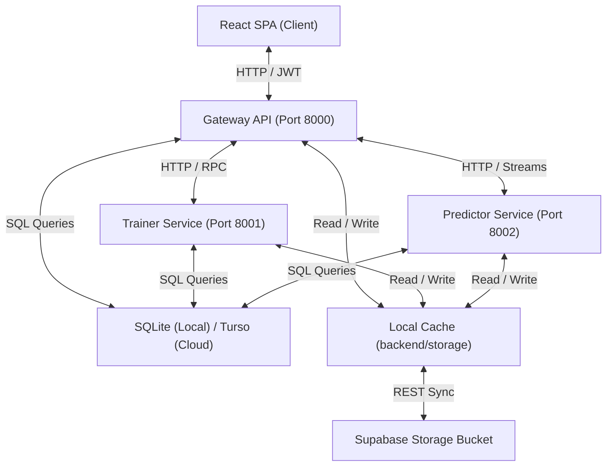

# InstaML

InstaML is a no-code machine learning platform built with a React frontend and FastAPI microservices. It allows users to upload datasets, configure preprocessing steps, visualize statistical relations, train classification/regression models, and execute predictions.

## Microservices Architecture

InstaML splits Gateway orchestration, Optuna training threads, and Predictor inferences into separate services:



## Documentation Directory

Explore the specialized guides below to configure, run, or deploy the platform:

*   [Installation & Setup Guide](file:///c:/Users/SSN/OneDrive%20-%20Shiv%20Nadar%20University%20-%20Chennai/Desktop/instaml/docs/setup.md) - Run backend microservices and frontend clients locally with or without Docker.
*   [Production Deployment Guide](file:///c:/Users/SSN/OneDrive%20-%20Shiv%20Nadar%20University%20-%20Chennai/Desktop/instaml/docs/deployment.md) - Host databases on Turso, objects on Supabase, backend on Render, and frontend on Vercel free-tiers.
*   [System Architecture Details](file:///c:/Users/SSN/OneDrive%20-%20Shiv%20Nadar%20University%20-%20Chennai/Desktop/instaml/docs/architecture.md) - Learn about microservice routers, database schemas, and local-cloud cache sync loops.
*   [Contributing Guide](file:///c:/Users/SSN/OneDrive%20-%20Shiv%20Nadar%20University%20-%20Chennai/Desktop/instaml/docs/contribution.md) - Find repository directory layouts, design rules, and unit/integration testing logs.

## Core Features

*   **Intelligent Data Upload**: Upload CSV, Excel, Parquet, and ZIP files with automatic column and task detection.
*   **Interactive Preprocessing**: Clean data, handle missing values, drop columns, scale features, and encode categories.
*   **Exploratory Data Analysis (EDA)**: Descriptive statistics, distribution plots (Box plots, Histograms, KDE, CDF), correlations, and PCA/K-Means clustering.
*   **Model Training**: Train machine learning models (XGBoost, Random Forests, Multi-Layer Perceptrons) with Optuna hyperparameter tuning and K-Fold cross-validation.
*   **Specialized Modalities**: Pretrained pipelines for text sentiment/summarization/NER, computer vision face detection/OCR, and audio noise reduction/ASR.
*   **Deployment**: One-click model deployment, REST API generation, real-time prediction forms, and dataset version checkpoints.

## Quick Start (Docker Compose)

Start the entire stack using Docker Compose:

1.  Make sure Docker Desktop is running.
2.  Launch the services:
    ```bash
    docker-compose up --build
    ```
3.  Open http://localhost:5173/ in your browser.

## License

This project is licensed under the MIT License.
