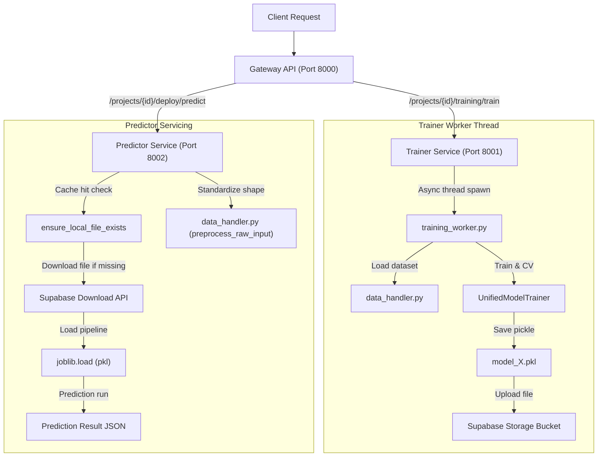

# InstaML Backend Services

This directory contains the backend services for the InstaML platform. It is structured as three FastAPI microservices.

## Services Interaction Diagram

The diagram below maps request routings and internal execution flows inside the backend services:



## 1. Services Architecture

*   **Gateway API (Port 8000)**: Primary entrypoint. Handles user authentication, project details, EDA metrics, and proxies training/prediction requests.
*   **Trainer Service (Port 8001)**: Runs background model training tasks, Optuna hyperparameter optimization, and cross-validation.
*   **Predictor Service (Port 8002)**: Runs low-latency prediction and preprocesses inference data.

## 2. Directory Map

```
backend/
├── app/
│   ├── api/                   # Router Endpoints (auth, data, deployment, eda, nlp, projects, training)
│   ├── core/                  # App configurations, training workers, and Supabase cache clients
│   └── db/                    # Pydantic schemas, session managers, and SQLite/Turso migrations
├── core/                      # Shared UnifiedModelTrainer core library code
├── requirements.txt           # Python package dependencies
└── *.py                       # Mock and integration tests
```

## 3. Database & Migrations

The database client uses `libsql-client` supporting local SQLite (`instaml.db`) and remote Turso database clusters. Table schemas (`users`, `projects`, `dataset_versions`, `models`) migrate automatically on startup.

## 4. Storage & Caching Sync

Files are written to local disk under `backend/storage/` first. If `SUPABASE_URL` and `SUPABASE_KEY` are set in the `.env` file, the storage helper uploads files to the cloud bucket and downloads them on demand if missing from local container disk.

## 5. Verification Tests

Run verification tests from this directory:
```bash
python -m unittest test_supabase_mock.py
python -m unittest test_cv_and_mlp.py
python test_modalities_e2e.py
```
