# InstaML Frontend Client

This directory contains the React single-page application (SPA) client for the InstaML platform.

## Technology Stack

*   **UI Library**: React 18, Vite.
*   **Routing**: React Router DOM (v6) with ProtectedRoute guards.
*   **Charts**: Recharts (for descriptive EDA charts, correlations, and test evaluation matrices).
*   **API Connection**: Axios client with JWT authorization headers.

## Component Hierarchy Diagram

The structure of routes, pages, and components inside the application:

```mermaid
graph TD
    App["App.jsx (Router & Toaster)"] --> Landing["Landing.jsx"]
    App --> Login["Login.jsx"]
    App --> Register["Register.jsx"]
    App --> Protected["ProtectedRoute Guard"]
    
    Protected --> Dashboard["Dashboard.jsx (List Projects)"]
    Protected --> Settings["Settings.jsx (User Updates)"]
    Protected --> Guidelines["Guidelines.jsx (Tutorials)"]
    Protected --> Pipeline["PipelineLayout.jsx (Stage Workspace)"]
    
    subgraph Shared Layout Components
        Pipeline --> Sidebar["Sidebar.jsx (Navigation Menu)"]
        Pipeline --> Background["InteractiveBackground.jsx (Canvas Backdrop)"]
        Pipeline --> Nav["PipelineNavigation (Wizard Back/Next Controls)"]
    end
    
    subgraph Pipeline Views
        Pipeline --> DataUpload["DataUpload.jsx (File Drag-Drop)"]
        Pipeline --> Preprocessing["Preprocessing.jsx (Clean/Scale/Encode)"]
        Pipeline --> EDA["EDA.jsx (Plots & Heatmap)"]
        Pipeline --> FeatureEng["FeatureEngineering.jsx (Transforms)"]
        Pipeline --> TrainModel["TrainModel.jsx (Optuna & CV Configuration)"]
        Pipeline --> TestModel["TestModel.jsx (Evaluation Metrics & Confusion Matrix)"]
        Pipeline --> Deployment["Deployment.jsx (Predict Widgets & API Docs)"]
        Pipeline --> Versions["Versions.jsx (Checkpoints list & Restore Modal)"]
        Pipeline --> NLPPlayground["NLPPlayground.jsx (Text Analyzer)"]
    end
```



## Directory Structure

```
frontend/
├── public/                 # Static public assets
├── src/                    # Source code
│   ├── components/         # Canvas backdrops, sidebars, and navigation triggers
│   ├── context/            # AuthContext login session handlers
│   ├── pages/              # Views (Dashboard, Upload, EDA, Preprocess, Train, Test, Deploy, Versions)
│   ├── services/           # API client instance (api.js)
│   ├── App.jsx             # Router definition and route guards
│   └── index.css           # Vanilla CSS theme system
├── package.json            # Node configurations
└── vite.config.js          # Vite configuration options
```

## Router URL Layout

The pages render inside the pipeline layout route `/projects/:project_id/`:

*   `/upload`: DataUpload page
*   `/preprocess`: Preprocessing page
*   `/eda`: EDA page
*   `/feature-eng`: FeatureEngineering page
*   `/train`: TrainModel page
*   `/test`: TestModel page
*   `/deploy`: Deployment page
*   `/versions`: Versions list
*   `/playground`: NLP text playground

## Run Scripts

Install dependencies with `npm install` first.

### Start Development Server
```bash
npm run dev
```

### Build Client for Production
```bash
npm run build
```
